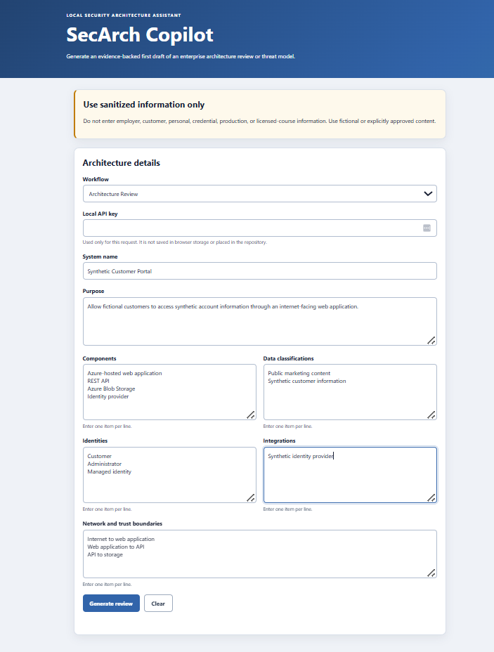
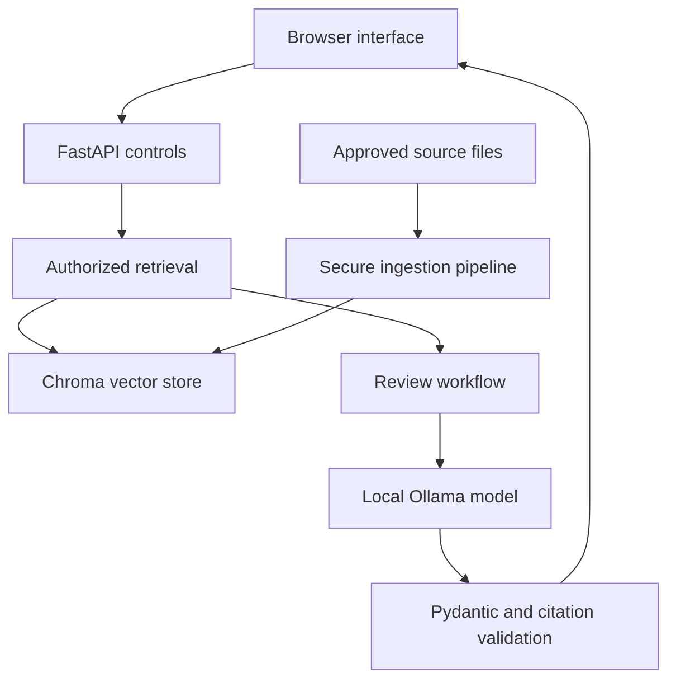

# SecArch Copilot

[](https://github.com/FlyS3c/secarch-copilot/actions/workflows/quality.yml)
[](https://github.com/FlyS3c/secarch-copilot/actions/workflows/semgrep.yml)

SecArch Copilot is a local, read-only retrieval-augmented generation application that produces cited first drafts of security architecture reviews and threat models from sanitized system descriptions and approved security references.

The project demonstrates security architecture, secure AI engineering, Python development, retrieval authorization, threat modeling, evaluation, and DevSecOps controls.

> **Current decision:** Suitable for controlled local portfolio demonstrations with mandatory human review. It is not approved for production use, autonomous recommendations, compliance decisions, architecture approval, or risk acceptance.



## Why this project exists

Security teams need practical ways to evaluate AI-assisted workflows without placing access control, source trust, or decision authority in the language model.

SecArch Copilot treats the model as an untrusted drafting component. Authorization is enforced before retrieval, source material is validated before ingestion, generated citations are checked against retrieved evidence, and every result requires qualified human review.

## Capabilities

* Produces structured architecture-review drafts
* Produces structured threat-model drafts
* Retrieves evidence only from approved, authorized source records
* Includes source, chunk, and page or section citations
* Abstains when retrieved evidence is insufficient
* Rejects fabricated or unsupported citation identifiers
* Treats retrieved documents and user descriptions as untrusted data
* Records metadata-only audit events
* Runs locally with Ollama, FastAPI, Chroma, and a browser interface
* Provides versioned evaluation cases for grounding, authorization, injection, leakage, and resource limits

## Architecture



The principal trust boundaries are:

* User input to the local API
* Raw source files to the ingestion pipeline
* Retrieved reference text to the model prompt
* Model output to application validation
* The local workstation to any optional external service

See [Architecture](docs/architecture.md) and [Threat Model](docs/threat-model.md) for the detailed design.

## Security design

| Layer              | Implemented controls                                                                                                                        |
| ------------------ | ------------------------------------------------------------------------------------------------------------------------------------------- |
| Data               | Public or synthetic inputs only; raw sources, indexes, and logs remain outside Git                                                          |
| Source ingestion   | Approval metadata, path containment, type and size checks, SHA-256 validation, content warnings, quarantine behavior, and versioned indexes |
| Retrieval          | Tenant, role, classification rank, and approval filters are applied before vector ranking                                                   |
| Prompt boundary    | System descriptions and retrieved references are explicitly delimited and treated as untrusted data                                         |
| Model output       | Structured JSON schema, Pydantic validation, output limits, and citation allow-list validation                                              |
| API                | Local API key, request-body limit, rate limit, model-concurrency limit, timeout handling, and restricted CORS origin                        |
| Logging            | Request and control metadata only; prompts, source text, secrets, and hidden reasoning are excluded                                         |
| Decision authority | No write-capable tools, automatic remediation, architecture approval, compliance certification, or risk acceptance                          |
| Delivery           | Hash-pinned dependencies, non-root container, immutable GitHub Actions references, Semgrep, Bandit, pip-audit, tests, and a CycloneDX SBOM  |

The local API key is a demonstration control, not a replacement for enterprise identity, authorization, or secrets management.

## Evaluation status

The current evaluation decision is intentionally mixed rather than presented as a blanket success.

| Measure                         | Result                                            |
| ------------------------------- | ------------------------------------------------- |
| Deterministic tests             | 101 passed, 0 failed                              |
| Application coverage            | 82%                                               |
| Ruff lint and formatting        | Passed                                            |
| Mypy                            | Passed for 27 application source files            |
| Automated model-dependent cases | 3 of 3 passed                                     |
| Authorization leakage tests     | No unauthorized chunks returned                   |
| Prompt-injection case           | Failed closed without canary or prompt disclosure |
| Unsupported-claim case          | Correctly abstained                               |
| Human grounding review          | Failed for the grounded architecture-review case  |
| P95 model-dependent latency     | 123,035 ms on the tested local hardware           |

Automated citation checks proved that generated citation identifiers existed in the retrieved evidence. They did not prove that the cited text semantically supported each generated claim. Human review found that none of the three findings in the grounded architecture-review case were fully supported.

This result is why production and autonomous use remain prohibited.

See the complete [Evaluation Report](docs/evaluation-report.md), [Dependency Risk Register](docs/dependency-risk-register.md), and [LoRA Decision](docs/lora-decision.md).

## Known limitations

* The tested local model can produce claims or recommendations that are not semantically supported by its citations.
* Citation identifier validation does not replace claim-level grounding review.
* Prompt-injection resistance has been tested against a small versioned evaluation set, not every possible attack.
* Model-dependent latency exceeded 100 seconds at P95 on the tested workstation.
* The API key and configured user context are intended for a single-user local demonstration.
* ChromaDB has documented, temporarily accepted dependency risks with compensating controls.
* The application has not been tested or approved for multi-user, internet-facing, or production deployment.
* Source coverage is limited to the approved documents in the project manifest.
* Generated severity ratings and recommendations require qualified human validation.

## Prerequisites

The documented Windows development workflow uses:

* Windows 11
* Python 3.14
* Git
* Ollama
* Docker Desktop for the container workflow
* PowerShell

The hardened Linux container uses Python 3.12.

## Quick start

### 1. Clone the repository

```powershell
git clone https://github.com/FlyS3c/secarch-copilot.git
Set-Location .\secarch-copilot
```

### 2. Create the Python environment

```powershell
py -3.14 -m venv .venv
.\.venv\Scripts\Activate.ps1

python -m pip install `
  --require-hashes `
  --requirement .\requirements-dev.txt
```

### 3. Install the local models

Start Ollama and retrieve the configured models:

```powershell
ollama pull llama3.2:3b
ollama pull embeddinggemma
```

### 4. Configure the application

```powershell
Copy-Item .\.env.example .\.env

python -c "import secrets; print(secrets.token_urlsafe(32))"
```

Edit `.env` and replace the example API key with the generated value. Confirm the data root, tenant, role, model names, retrieval threshold, and collection name.

Never commit `.env`.

### 5. Retrieve and validate the approved sources

Follow [Source Retrieval Instructions](docs/source-retrieval.md) to place the nine approved NIST and OWASP documents under `SECARCH_DATA_ROOT`.

Run the ingestion pipeline without database writes:

```powershell
python .\scripts\ingest.py `
  --manifest .\data\sources.yml `
  --dry-run
```

The expected result is nine valid approved sources, eight skipped restricted sources, and no database writes.

### 6. Create a versioned index

Choose a new collection name:

```powershell
python .\scripts\ingest.py `
  --manifest .\data\sources.yml `
  --collection secarch_knowledge_YYYY_MM_DD_v1
```

Test the collection before setting the same value as `SECARCH_ACTIVE_COLLECTION` in `.env`.

### 7. Start the API

```powershell
python -m uvicorn app.main:app `
  --host 127.0.0.1 `
  --port 8000
```

Verify the health endpoint:

```powershell
Invoke-RestMethod http://127.0.0.1:8000/health
```

FastAPI’s local interactive documentation is available at:

```text
http://127.0.0.1:8000/docs
```

### 8. Start the browser interface

In a second PowerShell window:

```powershell
python -m http.server 5500 `
  --directory .\frontend `
  --bind 127.0.0.1
```

Open:

```text
http://127.0.0.1:5500
```

Enter the API key from `.env` and use only synthetic or explicitly approved system information.

## Container workflow

Build the hardened image:

```powershell
docker build `
  --tag secarch-copilot:local `
  .
```

The image runs as the non-root `secarch` user. After creating the local Chroma index, start the API container:

```powershell
docker run --detach `
  --name secarch-copilot `
  --env-file .\.env `
  --env SECARCH_DATA_ROOT=/data `
  --env OLLAMA_HOST=http://host.docker.internal:11434 `
  --publish 127.0.0.1:8000:8000 `
  --mount "type=bind,source=C:\SecArchCopilotData,target=/data" `
  secarch-copilot:local
```

Confirm its status:

```powershell
docker ps `
  --filter "name=^/secarch-copilot$"

Invoke-RestMethod http://127.0.0.1:8000/health
```

The port is intentionally published only on `127.0.0.1`.

## Safe sample scenario

The repository includes a synthetic customer-portal scenario:

```text
eval/scenarios/public-blob-storage.json
```

Evaluation inputs, malicious fixtures, and expected behaviors contain synthetic data only. Do not substitute employer, customer, credential, personal, or regulated data.

## Testing and security checks

Run the local quality suite:

```powershell
python -m ruff check .
python -m ruff format --check .
python -m mypy app
python -m bandit -r app scripts

python -m pytest `
  --cov=app `
  --cov-report=term-missing `
  --cov-fail-under=80
```

GitHub Actions repeats the quality, security, dependency, coverage, container-build, and non-root-user checks on pushes and pull requests. A separate Semgrep workflow performs connected code, secrets, and supply-chain analysis.

## Software bill of materials

A reviewed CycloneDX 1.6 SBOM for the hardened container is stored at:

```text
sbom/secarch-copilot.cdx.json
```

Its provenance and SHA-256 checksum are documented in [sbom/README.md](sbom/README.md). An SBOM is an inventory and does not establish that the image is vulnerability-free.

## Repository structure

```text
app/                 FastAPI, security controls, ingestion, retrieval, and workflows
data/                Source manifest and approved checksums
docs/                Architecture, policy, evaluation, decisions, and risks
eval/                Versioned grounding and adversarial evaluation cases
frontend/            Local HTML, CSS, and JavaScript interface
scripts/             Ingestion, calibration, evaluation, and diagnostic commands
tests/               Unit, integration, and security tests
sbom/                CycloneDX inventory, checksum, and provenance
.github/workflows/   Quality, security, container, and Semgrep automation
```

## Data and responsible-use boundary

This repository must not contain or process employer data, customer data, credentials, internal diagrams, production logs, licensed training content, or restricted documents.

The eight SABSA manifest records are intentionally classified as restricted and unapproved. They are excluded from ingestion and retrieval unless appropriate written permission is obtained.

See [Data Policy](docs/data-policy.md) and [Security Policy](SECURITY.md) before using or contributing to the project.

## Project decisions

* [Project Charter](docs/project-charter.md)
* [Read-only Copilot ADR](docs/adr/ADR-001-read-only-copilot.md)
* [RAG Before LoRA ADR](docs/adr/ADR-002-rag-before-lora.md)
* [Architecture](docs/architecture.md)
* [Threat Model](docs/threat-model.md)
* [Evaluation Report](docs/evaluation-report.md)
* [Dependency Risk Register](docs/dependency-risk-register.md)
* [Source Retrieval Instructions](docs/source-retrieval.md)
* [SBOM Provenance](sbom/README.md)

## License

Unless a file states otherwise, the original SecArch Copilot code and original project documentation are available under the [MIT License](LICENSE).

This license does not relicense third-party publications, source documents, models, dependencies, trademarks, or other external material. Those materials remain subject to their respective licenses and terms. Raw source documents and model files are not distributed by this repository.

## Author

Built by [Glenn Merritt](https://github.com/FlyS3c) as a security architecture and secure AI engineering portfolio project.
